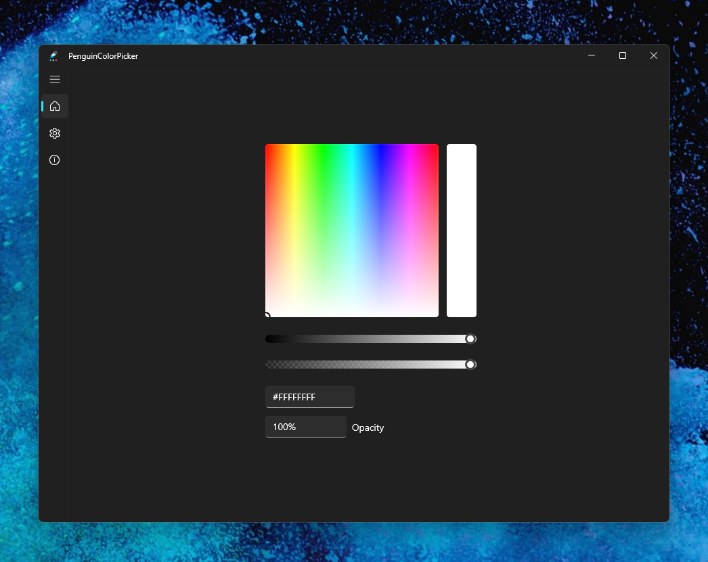

# PenguinColorPicker

Simple ColorPicker written in C# for UWP that allows you to select an color from the Color Spectrum and show its hex code or the other way around

# Screenshot

# Credits:

App icon designed by [Freepik](https://www.flaticon.com/authors/freepik) from [Flaticon.com](https://www.flaticon.com/)

Microsoft for WinUI, Visual Studio, ...

# Supported devices:

Windows 10/11 Desktop with Build equal or higher than 16229 and Windows 10 Mobile Build equal or higher than 15063

x86, x64, ARM (32bit) and ARM (64bit)

# Dependencies:

- Microsoft.NET.Native.Framework.2.2
- Microsoft.NET.Native.Runtime.2.2
- Microsoft.VCLibs.140.00
- Microsoft.UI.Xaml.2.7
